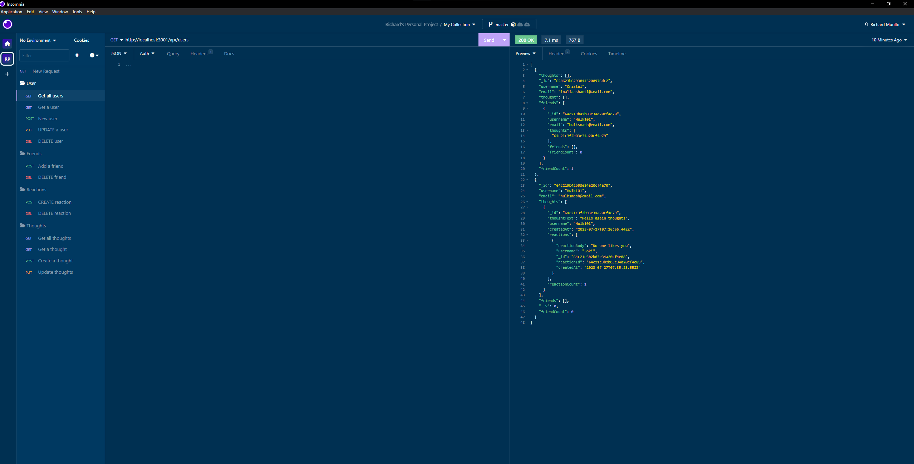
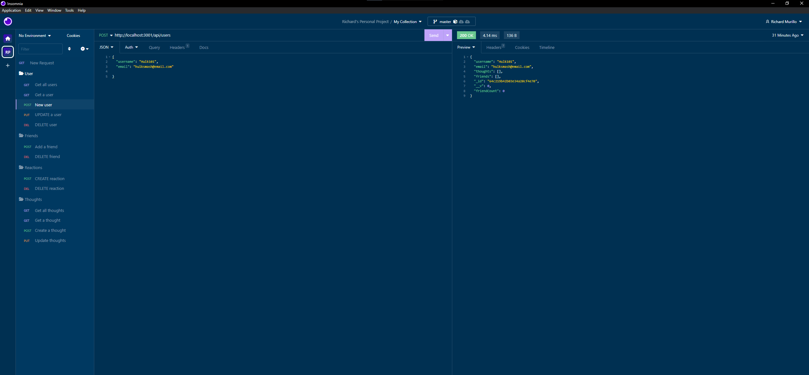
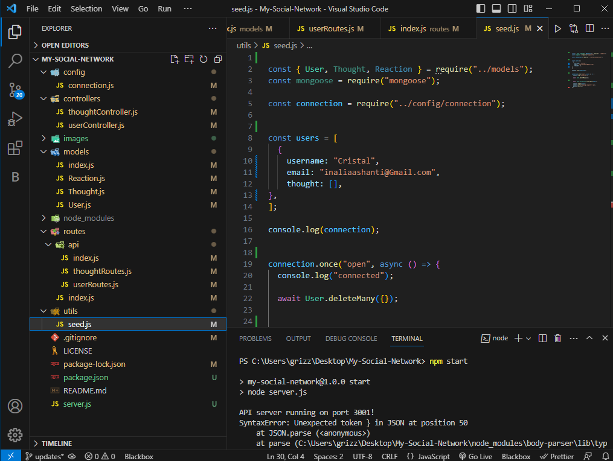

# My-Social-Network

## Table of Contents

- [Description](#description)

- [Live-Recording](#live-recording)

- [Screenshots](#screenshots)

- [Technologies-Used](#technologies-used)

- [Installation](#installation)

- [Features](#features)

- [Contribution](#contribution)

- [Test-Instructions](#test-instructions)

- [License](#license)

- [Questions](#questions)

## Description
📝

This application was created as the start of a full stack social network application using a MongoDB database, Express.js routing, and the Mongoose ODM. It sets up the initial CRUD API routes for said application which allow users to be created, searched for, updated, and deleted. Users can also share their thoughts, react to friends' thoughts, create a friend list, and subsequently delete thoughts, reactions, friends, and themselves as a user. 

## Live Recording
📼

https://drive.google.com/file/d/1P1tRaCwfLAW9TRaLB3x4t5ng2oR7t9qz/view

## Screenshots
📸

 

 

## Technologies Used
✅

## Installation
💾

1. clone the repo: https://github.com/RichMur84/My-Social-Network.git.

2. Open in VS Code, Using the terminal, install node

3. Run the command npm i to install the dependencies or for each dependency run npm i express@4.18.2 and npm i mongoose

4. make sure you have Mongodb Compass installed in your system

5. In terminal run npm start in the root directory to start server.

6. From here you will need a program such as Insomnia to test the routes and edit them.

## Features
📚

This application include the ability to create users/thoughts, find all users/thoughts, find a single user/single thought, update user/thought information, and delete a user/thought. The ability to add reactions to particular thoughts.

## Contribution
💡

Open to collaboration, if you choose to do so open an issue and modify any changes you would like to see on a feature branch and wait for approval before merging to the main branch.

## Test Instructions
N/A

## License
📌

NOTICE: This application is covered under the MIT License

## Questions

👥

Have additional questions? Click the links below to reach me through my GitHub account or Email address.

[Link to Github](https://github.com/RichMur84)

<a href="mailto:grizzlylbc1@gmail.com">grizzlylbc1@gmail.com</a>
